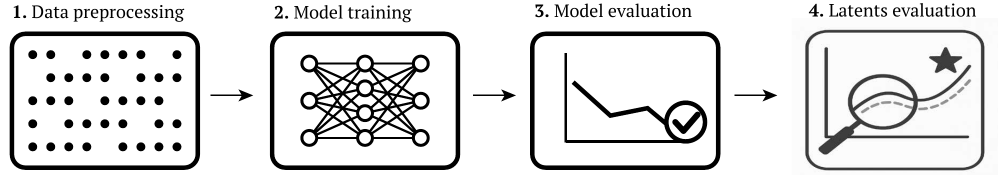
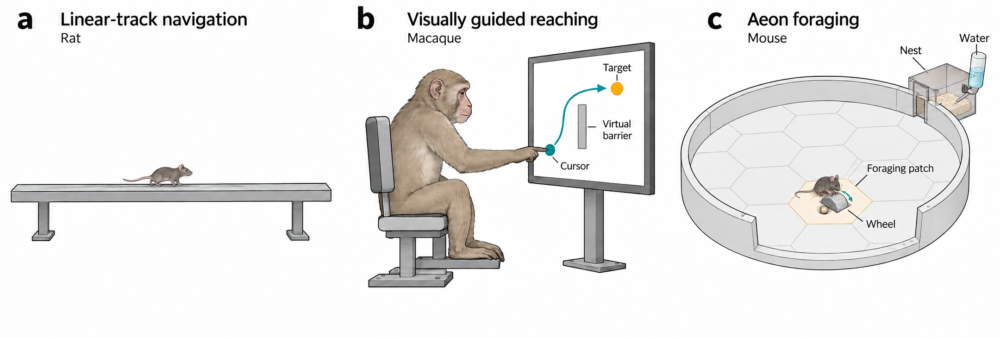
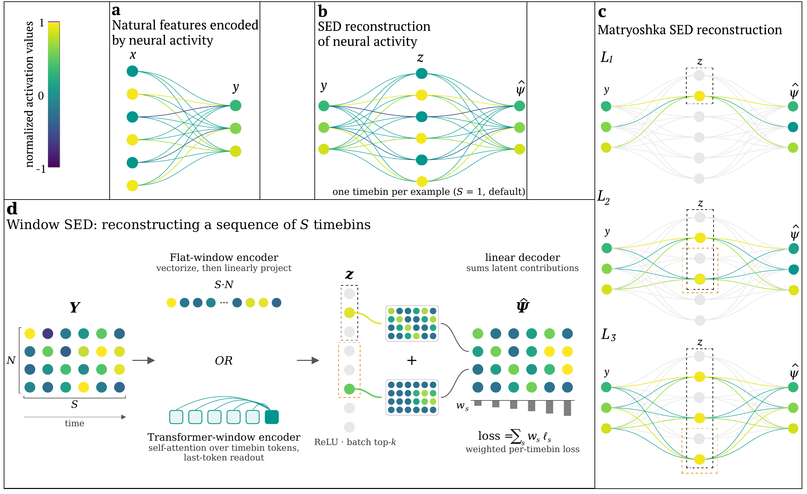
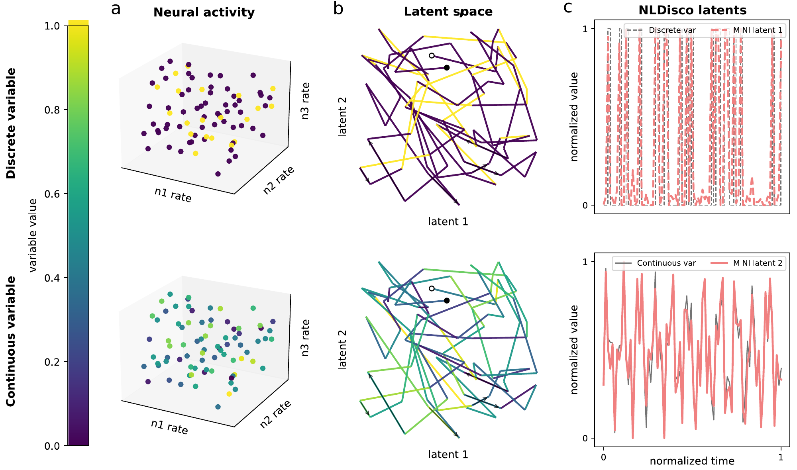
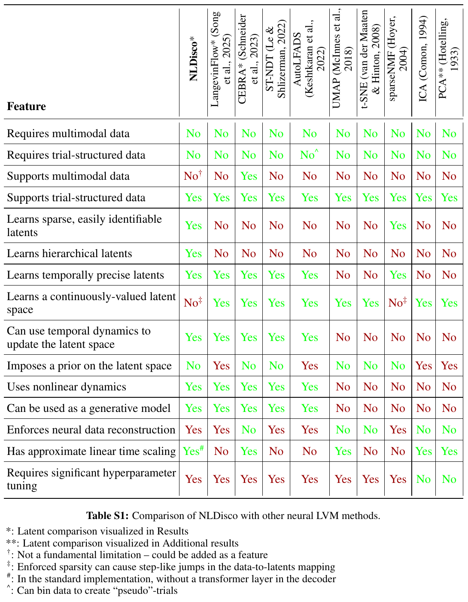

<div align="center">

# NLDisco

**Neural Latent Discovery**  
Find interpretable features in neural population activity.

[Quick start](#quick-start) · [User guide](#user-guide) · [Documentation](docs/README.md) · [Paper](paper/iclr_paper/full_paper.pdf) · [Experiments](experiments/README.md)

</div>



NLDisco learns sparse, overcomplete representations of neural activity. Each latent
is a candidate feature to inspect alongside behavior, stimuli, or other metadata.
Training uses neural activity alone; behavioral labels enter during interpretation.

- **Discover at multiple scales.** Matryoshka dictionaries learn nested sets of latents.
- **Capture temporal context.** Encode single bins or complete windows with linear or
  transformer encoders, including an optional shift-equivariant mode.
- **Connect populations.** Reconstruct the input population or predict an aligned target population.
- **Inspect what you learn.** Evaluate reconstruction, latent ablations, and spectral fidelity.



**NLDisco across datasets:** simulated navigation, macaque reaching, and mouse foraging.

## From activity to interpretable latents



**Figure 2 · Model architecture.** **(a)** Natural features are jointly encoded in neural
activity. **(b)** A sparse encoder-decoder reconstructs neural activity through a small
set of active latents; targets can be the input population or a separate, aligned
population. **(c)** Matryoshka levels each reconstruct the target using nested latent
sets. **(d)** Window models reconstruct every timebin using either a flattened linear
encoder (FW-SED) or a transformer encoder (TW-SED), with reconstruction scored per bin.

The Python API uses **[batch, timebin, unit]** tensors. Build a window model with:

```python
from nldisco import EncoderConfig, SedConfig, build_sed

model = build_sed(SedConfig(
    n_neurons=100,
    seq_len=8,
    dsed_topk_map={128: 4, 512: 8},
    encoder=EncoderConfig(type="TransformerWindow"),
))
```

Use `FlatWindow` for a linear encoder, or set `seq_len=1` for a single-bin SED.
For paired populations, set `n_output_neurons` and supply `targets=` to
`SpikeWindowDataset`; the CLI equivalents are `data.target_path` and
`data.target_normalization`. Inputs and targets share their time grid and splits,
while unit counts can differ. Inference needs only inputs.

See [models and inference](docs/model_names.md), the
[paired-population example](examples/paired_transcoder.py), and
[evaluation](docs/evaluation.md) for details.

## Why individual latents?



**Figure S1 · Interpretable latents in a complex latent space.** A toy example with a
discrete variable (top) and a continuous variable (bottom). **(a)** Both are encoded
in three neurons' firing rates. **(b)** A two-dimensional projection creates tangled
trajectories; white and black dots mark their start and end. **(c)** Individual
NLDisco latents track the variables, illustrating the aim of interpretable feature
discovery. This is a conceptual illustration, not a benchmark result.

## Method comparison

[](docs/assets/table-s1.png)

The paper's qualitative comparison of 15 methodological features. Click the table
for full resolution; see the [paper](paper/iclr_paper/full_paper.pdf) for context and references.

## Explore and develop

| Resource | Contents |
| --- | --- |
| [Documentation](docs/README.md) | Preprocessing, models, training, checkpoint reloads, and evaluation |
| [Examples](docs/tutorials/README.md) | Runnable walkthroughs using generated data |
| [Experiments](experiments/README.md) | Paper datasets, configurations, notebooks, and result artifacts |
| [Library](src/nldisco/) | Model, data, training, evaluation, plotting, and sweep code |

```console
uv run pytest                             # Core library tests
uv run pytest experiments/tests           # Paper-analysis tests
uv run jupyter lab
```

Churchland data helpers require `uv sync --extra churchland`.
To register a Jupyter kernel, run `uv run python -m ipykernel install --user --name=nldisco`.

## Quick start

From this checkout, install [uv](https://docs.astral.sh/uv/getting-started/installation/)
and sync the environment (Python 3.9):

```console
uv sync
uv run python examples/paired_transcoder.py --layout flat
```

The example generates its own data, trains a model, evaluates it, and demonstrates
inference. It also supports `single_bin`, `transformer`, and `shift_equivariant` layouts.

For your own data, supply a numeric `.npy` array shaped **[timebin, unit]**:

```console
# Train one model on nonnegative spike counts.
uv run python -m nldisco.sweep --config-name train data.path=/path/to/counts.npy training.epochs=10

# Sweep learning rates and seeds with two local workers.
uv run python -m nldisco.sweep data.path=/path/to/counts.npy execution.max_parallel=2
```

The defaults use MSLE loss and a ReLU decoder. For signed targets, including z-scores,
set `loss.type=mse model.decoder.output_activation=none`.
See [preprocessing](docs/preprocessing.md) for Kilosort/Phy loading and spike binning,
and [training and sweeps](docs/training_and_sweeps.md) for GPU, W&B, and Slurm execution.

## User guide

A Kilosort/Phy recording can move through the full pipeline in five steps.

**1. Load and bin spikes.** `load_kilosort` reads sorter exports and retains the
unit-ID mapping. Set the actual sampling rate and recording duration:

```python
import numpy as np
from nldisco.data import load_kilosort

binned = load_kilosort(
    "/path/to/kilosort", sampling_rate=30_000, bin_size=0.02,
    start_time=0, stop_time=600,
)
np.save("counts.npy", binned.counts)
np.save("timestamps.npy", binned.timestamps)
np.save("unit_ids.npy", binned.unit_ids)
```

**2. Preprocess and split.** Keep the saved counts raw. The runner below fits z-score
normalization on training rows only, then applies it to validation rows. It builds
8-bin windows with an 80/20 chronological split. Supply trial/session IDs and validity
masks when needed to prevent windows crossing boundaries; see [preprocessing](docs/preprocessing.md).

**3. Train with a W&B sweep.** Authenticate with `uv run wandb login` (or set
`WANDB_API_KEY` in `.env`), then launch a Bayesian search over learning rates and seeds:

```console
uv run python -m nldisco.sweep --config-name wandb \
  data.path=counts.npy data.timestamps=timestamps.npy data.expected_bin_size=0.02 \
  data.normalization=zscore loss.type=mse model.decoder.output_activation=none \
  training.epochs=20 search.max_runs=10 wandb.project=nldisco-kilosort
```

W&B minimizes `validation/loss`. Each trial saves its configuration, calibrated
checkpoint, and reconstruction metrics under `outputs/nldisco/`.
[Training and sweeps](docs/training_and_sweeps.md) covers search spaces and GPU/Slurm settings.

**4. Evaluate the model.** Pick a trial using validation results and reload its checkpoint.
With the original recording files unchanged, rebuild the same split and preprocessing:

```python
from nldisco.sweep.training import load_checkpoint, model_and_loss, prepare_data
from nldisco.train import evaluate_model
from nldisco.plot import plot_reconstruction_by_lag

saved = load_checkpoint("outputs/nldisco/<invocation>/run-0000/model.pt")
model = saved.model
_, loss = model_and_loss(saved.config, model.cfg.n_neurons, model.cfg.n_output_neurons)
_, validation, _ = prepare_data(saved.config, model.cfg)
result = evaluate_model(model, validation, loss)
print(result.metrics_by_lag)
plot_reconstruction_by_lag(result.metrics_by_lag)
```

Optional [ablation and spectral diagnostics](docs/evaluation.md) test individual latent
contributions and frequency fidelity. Keep a separate test set for final reporting.

**5. Evaluate the latents.** Inspect decoder patterns and align latent activations with
behavior. For example, plot latent 0 over the eligible validation positions, retaining
zeros where it was inactive:

```python
from nldisco.plot import plot_decoder_feature

plot_decoder_feature(model.decoder, latent_idx=0)
latent = result.evaluation_index[["source_time_idx"]].merge(
    result.activation_table.query("latent_idx == 0")[["source_time_idx", "activation_value"]],
    on="source_time_idx", how="left",
).fillna({"activation_value": 0})
latent["time_s"] = np.load("timestamps.npy")[latent.source_time_idx]
latent.plot(x="time_s", y="activation_value")
```

Synchronize behavioral measurements to the recording clock, then join them through
`source_time_idx`. Compare tuning and activating examples; quantify candidate features
with coverage, specificity, and AUROC over both active and inactive positions.
Decoder weights describe reconstructed activity; they are not causal attributions.
See the [paper experiments](experiments/README.md) for dataset-specific latent analyses.
